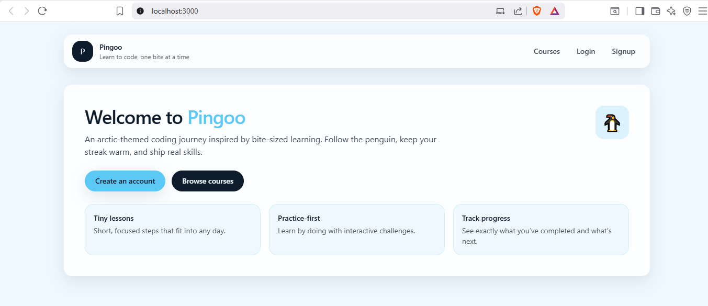
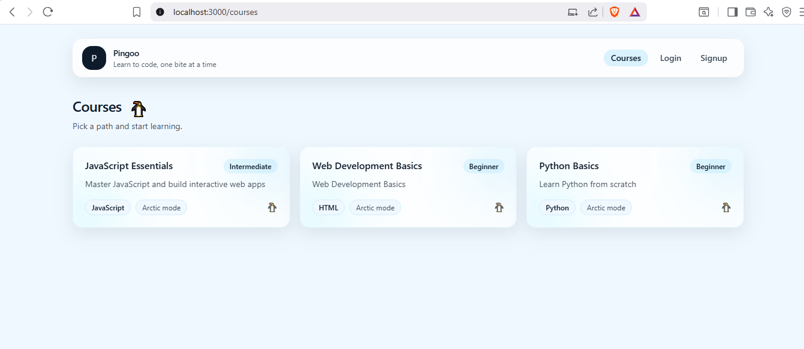
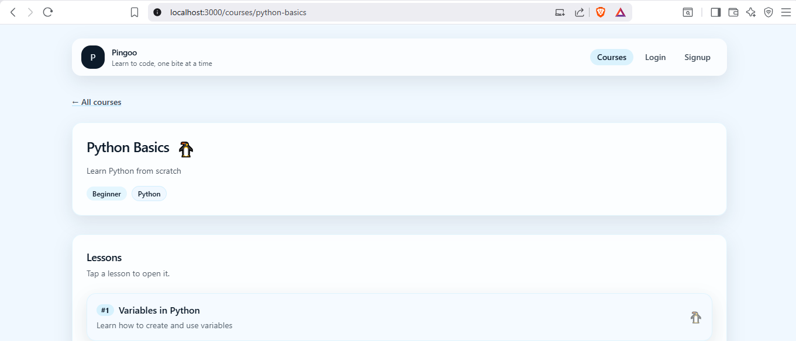
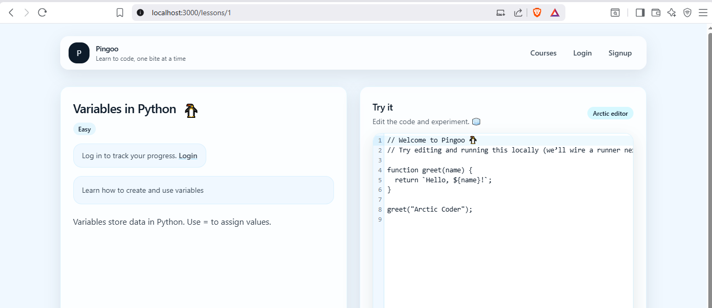

# Pingoo

Pingoo is a gamified, **arctic-themed** coding learning platform. Learners follow short lessons, practice in-browser, and track progress—wrapped in a frosty UI with a penguin mascot and a Mimo-inspired bite-sized flow.

This repository contains a **Django REST Framework** API and a **React** single-page app that consume it.

---

## Features

- **Courses and lessons** — Browse published courses, open a course to see ordered lessons, and read lesson content.
- **Interactive editor** — Lessons include a CodeMirror-based editor with an “arctic ice” visual style for experimentation.
- **Accounts and JWT auth** — Register, log in, and receive JSON Web Tokens; the React app stores tokens and attaches them to API calls.
- **Progress** — Mark lessons complete; progress is upserted per user and lesson on the backend.
- **Gamified tone** — Ice palette, mascot accents, and streak-friendly copy geared toward daily learning.
- **CORS-ready dev setup** — Backend allows the React dev server origin for local development.

---

## Tech stack

| Area | Technologies |
|------|----------------|
| **Backend** | Python, Django, Django REST Framework, SimpleJWT, django-cors-headers, SQLite (default) |
| **Frontend** | React (Create React App), React Router, Tailwind CSS, Axios, `@uiw/react-codemirror` |
| **API style** | REST + JWT bearer tokens |

---

## Repository layout

```
pingoo/
├── backend/          # Django project (pingoo_backend) + api app
│   ├── manage.py
│   └── pingoo_backend/
└── frontend/         # React app (CRA)
    └── src/
```

---

## Prerequisites

- **Python** 3.12+ (compatible with Django 6.x)
- **Node.js** 18+ and **npm**
- A modern browser

---

## Run locally

### 1. Backend (API)

From the repository root:

```bash
cd backend
python -m venv .venv
```

Activate the virtual environment:

- **Windows (PowerShell):** `.\.venv\Scripts\Activate.ps1`
- **macOS/Linux:** `source .venv/bin/activate`

Install dependencies (pin versions in your own `requirements.txt` as needed):

```bash
pip install django djangorestframework djangorestframework-simplejwt django-cors-headers
```

Apply migrations and start the server:

```bash
python manage.py migrate
python manage.py runserver 8000
```

The API base URL is **`http://localhost:8000/api/`** (for example: `http://localhost:8000/api/courses/`).

Optional: create an admin user to add courses and lessons in the Django admin.

```bash
python manage.py createsuperuser
```

Then open **`http://localhost:8000/admin/`**.

### 2. Frontend (React)

In a second terminal, from the repository root:

```bash
cd frontend
npm install
npm start
```

The app runs at **`http://localhost:3000`** and is configured to call the API on **`http://localhost:8000`** (see `frontend/src/lib/api.js`).

Ensure the backend **CORS** settings allow `http://localhost:3000` so the browser can call the API.

### 3. Quick smoke test

1. Register or log in from the React app.
2. Open **Courses** — list should load from `/api/courses/`.
3. Open a course — lessons load from `/api/lessons/?course=<slug>`.
4. Open a lesson — complete it with **Mark as Complete** if authenticated (`/api/progress/upsert/`).

---

## Screenshots

### Home

Landing page with penguin branding and arctic styling.



### Courses

Course grid with frosted cards.



### Course detail

Lesson list for a single course.



### Lesson

Lesson content with interactive code editor.



---

## License

Specify your license here (for example MIT, Apache-2.0, or proprietary).

---

## Contributing

Describe how you accept contributions: issues, branching, code style, and tests. If this is a private or course project, note that here instead.
